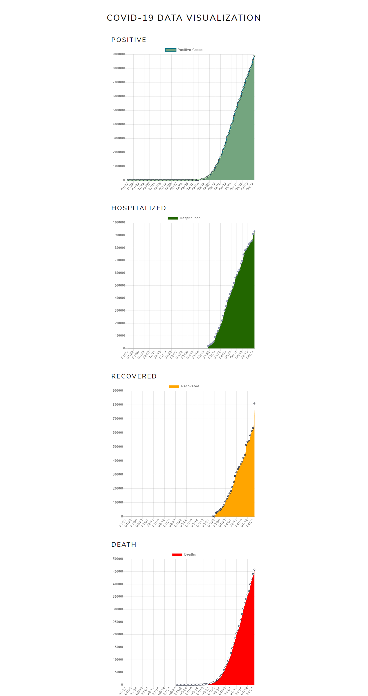

# Covid-19 Data Visualization Chart

an application that display information in chart using Vuejs. Built it while learning Data visualization



## Project setup

```
npm install
```

### Compiles and hot-reloads for development

```
npm run serve
```
